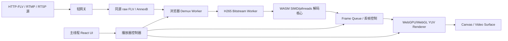

# 浏览器 H265 软解码器突破方案

## 一句话目标

做一个在浏览器没有 HEVC/H265 原生硬解时仍然可用的高性能 H265 播放内核。

它不是替代浏览器硬解，而是解决这个场景：

```text
浏览器不能硬解 H265
服务器又不想转码
那就把解码压力放到用户浏览器里
```

## 关键边界

先把边界说死，避免走偏：

```text
WASM / Worker / WebGPU 不能直接调用系统硬解
```

所以我们能做的是浏览器内软解优化：

```text
WASM SIMD/pthreads 负责 H265 软解
Worker 负责线程拆分和调度
WebGPU/WebGL 负责 YUV 渲染、色彩转换、缩放、后处理
主线程只负责 UI 和少量控制
```

## 总体架构



## 为什么不能只靠 WebGPU

H265 解码不是单纯的 GPU 并行计算。

它里面有几类工作：

| 模块 | 适合 WebGPU 吗 | 说明 |
|---|---:|---|
| 码流解析 | 不适合 | 分支多、状态强 |
| CABAC 熵解码 | 很不适合 | 强串行，前后依赖重 |
| 反量化/反变换 | 适合 | 数学计算多，可以并行 |
| 运动补偿 | 部分适合 | 有参考帧依赖 |
| 去块滤波/SAO | 部分适合 | 可以按块并行，但边界复杂 |
| YUV 转 RGB | 非常适合 | GPU 强项 |
| 缩放/绘制 | 非常适合 | GPU 强项 |

所以最佳策略不是“用 WebGPU 重写整个 H265 解码器”，而是：

```text
CPU/WASM 做串行和标准解码主流程
WebGPU/WebGL 做最适合 GPU 的图像计算和渲染
```

## 第一阶段 POC

第一阶段不要贪大，先做“一路播放明显更稳”。

目标：

```text
1080p H265
没有浏览器硬解
服务器不转码
浏览器端软解
稳定达到当前源帧率
```

如果源本身是 25fps，就先稳定 25fps。

不要用 25fps 源证明 40fps。要测 40fps，必须找真实 40/50/60fps H265 源。

## 第一阶段核心设计

### 1. 解码线程池

浏览器侧分成几个 Worker：

```text
Demux Worker
  负责 FLV/fMP4 解封装，提取 H265 NALU

Decode Worker
  负责 WASM H265 解码

Render Worker
  可选，负责 OffscreenCanvas + WebGPU/WebGL 渲染
```

第一版不要盲目开很多线程。

建议：

```text
2 核机器：1 decode worker + 1 render/main
4 核机器：2 decode threads + 1 render worker
8 核机器：3-4 decode threads + 1 render worker
```

线程不是越多越好。H265 有串行部分，线程太多会增加同步成本。

### 2. 帧队列策略

实时视频不能追求每一帧都显示。

我们要追求：

```text
低延迟
不断画
画面尽量新
```

所以队列策略应该是：

```text
最多缓存 3-5 帧
队列满了丢旧帧
优先保留最新帧
关键帧前不要乱解
卡顿后从下一个关键帧恢复
```

这比“努力播放所有旧帧”更适合摄像头预览。

### 3. WebGPU/WebGL 渲染

WASM 解码后通常拿到 YUV 数据。

不要走 Canvas 2D 做大量像素转换。

应该走：

```text
Y plane
U plane
V plane
  |
  |-- 上传 GPU texture
  |
  |-- shader 做 YUV -> RGB
  |
  |-- 直接绘制到 canvas
```

WebGPU 优先级：

```text
WebGPU 可用 -> WebGPU renderer
WebGPU 不可用 -> WebGL renderer
都不可用 -> Canvas 2D 兜底
```

### 4. 动态降级

如果浏览器端软解追不上，不应该直接让画面卡死。

策略：

```text
渲染 FPS < 源 FPS 70%
  -> 降低渲染频率，只显示最新帧

解码 FPS 明显低
  -> 启用低延迟丢帧

连续 5 秒解码不足 12fps
  -> 提示当前设备性能不足
  -> 可选切服务器兼容转码
```

## 性能指标

必须把一帧拆开统计：

```text
总耗时 = 拉流等待 + 解封装 + 解码 + 队列等待 + 渲染
```

前端至少要采集：

| 指标 | 作用 |
|---|---|
| inputFps | 源实际进帧速度 |
| demuxFps | 解封装输出速度 |
| decodedFps | 解码输出速度 |
| renderedFps | 实际画出来的速度 |
| decodeCostMs | 单帧解码平均耗时 |
| renderCostMs | 单帧渲染平均耗时 |
| queueDepth | 队列堆积 |
| droppedFrames | 主动丢帧数量 |
| frameP95Ms | 帧间隔 P95，判断肉眼卡顿 |
| longTaskCount | 主线程是否被阻塞 |

判断规则：

```text
decodedFps 低
  -> 解码瓶颈，优化 WASM/线程/码流

decodedFps 高但 renderedFps 低
  -> 渲染瓶颈，优化 WebGPU/WebGL/OffscreenCanvas

queueDepth 持续升高
  -> 队列策略错了，要丢旧帧

longTask 很多
  -> 主线程被打爆，要迁移到 Worker
```

## 推荐实现路线

### 阶段 A：隔离实验播放器

新增独立实验播放器，不影响现有生产链路：

```text
apps/web-demo/src/players/experimental/
  H265TurboPlayer.ts
  workers/
    demux.worker.ts
    decode.worker.ts
    render.worker.ts
  renderers/
    WebGpuYuvRenderer.ts
    WebGlYuvRenderer.ts
  metrics/
    PlaybackProfiler.ts
```

默认不接入页面。

只通过 debug 参数或单独实验页启用：

```text
?experimentalDecoder=1
```

### 阶段 B：先复用成熟 WASM 解码核

不要第一步就从零写 H265 解码器。

第一阶段应复用：

```text
jessibuca / jv4 / h265web 的 WASM 解码核心
```

我们重点优化：

```text
数据喂入方式
Worker 调度
帧队列
WebGPU/WebGL 渲染
指标观测
```

等这条链路稳定后，再考虑替换更强的 WASM 解码核心。

### 阶段 C：WebGPU 渲染器

先做 WebGPU YUV Renderer，而不是 WebGPU H265 Decoder。

原因：

```text
收益明确
工程量可控
不会破坏解码正确性
容易 A/B 测试
```

### 阶段 D：更激进的解码优化

如果瓶颈确认在 WASM 解码，再考虑：

```text
更换解码核心
针对 1080p 低延迟场景裁剪能力
关闭不必要的音频/字幕/容器逻辑
减少内存拷贝
SharedArrayBuffer 环形缓冲
多线程 tile/slice 并行
```

## 预期上限

比较现实的判断：

| 场景 | 预期 |
|---|---|
| 720p H265 | 浏览器软解比较有希望流畅 |
| 1080p 25fps H265 | 高性能电脑有机会稳定 |
| 1080p 40fps+ H265 | WASM 软解压力很大，需要强机器和低拷贝链路 |
| 多路 1080p H265 | 不建议同一个浏览器页面软解多路 |

这不是泄气，是工程事实。

我们要突破的第一目标应该是：

```text
单路 1080p 25fps 不明显卡顿
```

再挑战：

```text
单路 1080p 40fps
```

## 最终产品策略

产品上应该这样分层：

```text
优先：浏览器原生硬解
  最省 CPU，体验最好

其次：浏览器 Turbo 软解
  服务器不转码，客户端吃 CPU

最后：服务器兼容转码
  最稳，但最吃服务器
```

用户看到的不是技术词，而是：

```text
极速模式
浏览器增强
兼容模式
```

## 结论

这个方向可以做，而且值得做。

但突破点不是一句“上 WebGPU”，而是完整链路优化：

```text
少拷贝
多 Worker
WASM SIMD/pthreads
实时丢帧策略
WebGPU/WebGL 渲染
可观测指标
```

先做隔离实验播放器，跑通数据，再决定是否接入主播放器。

